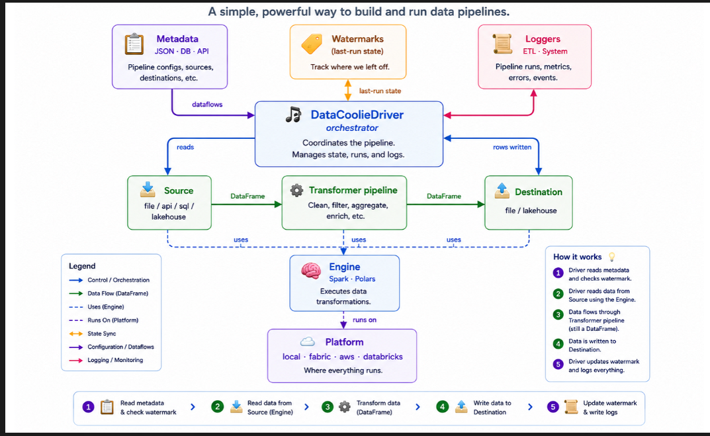

# SelFlow: Enterprise Financial Data Platform

> Executive Summary:

SelFlow is a modular, containerized financial data platform designed for secure, on premise transactional processing, high throughput ETL orchestration, and AI-assisted financial business intelligence. 
By uniting an optimized PostgreSQL 16 data warehouse, an asynchronous FastAPI backend, and an interactive Streamlit dashboard powered by a local Llama LLM query translation layer, SelFlow provides enterprise level data access control with zero public cloud exposure.

>Core Capabilities:

  1. High-Throughput Streaming ETL: Memory-mapped streaming, transforming, and batching of 6.3 million+ records using an advanced Polars Engine.

  2. Dynamic Local LLM Integration: Ask business questions in plain English; SelFlow translates them to schema-accurate, execution-safe SQL queries instantly.
  
  3. Auto-Visualization Engine: The Streamlit UI automatically analyzes query schemas on the fly, rendering responsive, interactive Altair charts (bar, line, scatter) based on numerical, categorical, or temporal data.

  4. Enterprise Operations Dashboard: Fully integrated health monitoring, database schema dictionaries, and operational diagnostics out of the box.
  
  
>Architecture Overview:

                                    *System Components & Data Pipeline Flow*

                        ┌─────────────────────────────────────────────────────────────┐
                        │                   User Browser (Port 8501)                  │
                        │               Streamlit Dashboard with Altair               │
                        └────────────────────┬────────────────────────────────────────┘
                                            │ HTTP / WebSockets
                                            ▼
                        ┌─────────────────────────────────────────────────────────────┐
                        │                 FastAPI Backend (Port 8000)                 │
                        │  • Automated SQL Generation Pipeline                        │
                        │  • RESTful System Metrics & Orchestration Endpoints         │
                        │  • LLM Prompt Parsing & Database Sandbox Safety Guards      │
                        └───────────┬───────────────────────────────▲────────────────┘
                                    │                               │
                                    │ Triggers ETL (Async Task)     │ Read / Write Queries
                                    ▼                               │
                        ┌───────────────────────────────────────────┴────────────────┐
                        │             Polars Streaming ETL Ingestion Engine           │
                        │  • Source: Large Raw Dataset (6.3M+ Rows CSV/Parquet)       │
                        │  • Lazy-Evaluation Projection & Filter Pushdown             │
                        │  • Memory-Mapped Partition Stream Parsing                   │
                        │  • PyArrow-Backed PostgreSQL Chunked Copy Buffer            │
                        └───────────┬────────────────────────────────────────────────┘
                                    │ Chunked Generator Streams (50,000 Rows/Batch)
                                    ▼
                        ┌─────────────────────────────────────────────────────────────┐
                        │          PostgreSQL 16 Data Warehouse (Port 5432)           │
                        │  • Partitioned Transactions & Staging Event Indexes         │
                        │  • Pre-aggregated Views & Temporal Aggregations             │
                        └─────────────────────────────────────────────────────────────┘

# The Ingestion Strategy: Loading 6.3 Million Records
  
  Processing millions of rows of dense financial transactions can easily cause memory spikes (Out-of-Memory crashes) or network socket exhaustion if not designed properly. Here is why we built our ingestion engine around Polars and how we safely stream data into PostgreSQL.
  
  
  >. Why Polars? (The Tech Selection)

  Traditional data processing setups in Python rely on Pandas, which loads the entire dataset into memory at once (e.g., a 1.5GB CSV easily blows up to 5GB+ of RAM when parsed). We selected Polars for several key architectural reasons:
    
  1. Memory-Mapped Files: Polars can read from disk directly using memory mapping, so we only consume the RAM required for the active batch being processed.

  2. Lazy Evaluation (LazyFrame): Instead of executing operations step-by-step, Polars builds a logical query plan. It optimizes operations (like pushing filters down to the file level) before processing any data.

  3.  Multi-Threaded Execution Engine: Written in Rust, Polars exploits every available CPU core in parallel without being bottlenecked by Python's Global Interpreter Lock (GIL).
  
  >. The Ingestion Engine: Streaming & Chunking
      To write 6.3 million records to PostgreSQL without crashing our database pool or locking tables, our pipeline uses a strict generator-driven chunking pipeline:

                                  [6.3M Row Source CSV] 
                                        │
                                        ▼ (Polars scan_csv() -> LazyFrame)
                                  [Memory-Mapped Lazy Stream] 
                                        │
                                        ▼ (Fetch in 50,000 Row Chunks)
                                  [Transformations: Schema Parsing, Value Tiering, Date Normalization]
                                        │
                                        ▼ (Convert Batch to PyArrow Tables)
                                  [Fast COPY Protocol / psycopg3 Binary Ingestion]
                                        │
                                        ▼
                                  [PostgreSQL Table: staging_transactions]

# How it works:

  1. Zero-RAM Data Scanning: We initiate the pipeline using *pl.scan_csv()*. This scans the structure of the dataset without loading the data into RAM.
  
  2. Deterministic Chunking: We slice the dataset into batch sizes of 50,000 rows. Each chunk is loaded, processed, and immediately dumped to the database before the next batch is read.
  
  3. Optimized Transform-on-the-Fly: Within each chunk, we enforce clean data types (e.g., casting datetime stamps, normalizing transaction status strings) using Polars' fast expressions.
  
  4. Fast *COPY* Database Loading: Using Python’s *psycopg3* binary connection library combined with PyArrow-backed tabular translation, we stream the rows into PostgreSQL using the raw *COPY* protocol. This bypasses slow, individual *INSERT* queries, completing the load of 6.3M rows in minutes rather than hours.
  
  # Technology Stack:
  
  Layer                           Technology                      Purpose 
  Orchestration                 Docker & Docker Compose         High-availability local container grouping
  Frontend UI                   Streamlit 1.35+ & Altair        Interactive layout, analytical pivots, and auto-charts
  API Framework                 FastAPI 0.110+ & Uvicorn        Asynchronous endpoint execution & JSON schema routing
  Data Engine                   Polars 0.20+ & PyArrow          Multi-threaded memory-efficient streaming ETL pipelines
  Database                      PostgreSQL 16 (Alpine)          Transaction ledger and dimensional schemas
  Observability                 Loguru & Local Metrics          Structured tracing, health status, and row-count metrics
  Private AI                    Ollama (Llama2 / Mistral)       Fully offline, on-premise SQL translation engine
  
  # Quick Start:

  *Prerequisites*
  >Docker Desktop (or Docker Engine + Compose plugin)
  >8GB+ System RAM (recommended to comfortably support local LLM execution)
  >5GB+ Disk Space (for database volumes and Docker base layers)
  
  # Installation & Execution1.: 
  
  1. Launch Services

  Clone your repository, navigate to the source root, and spin up the infrastructure:

      >Start all containers in the background 
        docker compose up -d
      
      >Verify operational health status of components
        docker compose ps

  2. Service Map
  
  Once up and running, you can access individual endpoints directly:

*Destination*                  *Local Address*                              *Target Role*
User Dashboard              http://localhost:8501                     Front-end analytics workspace & AI query terminal
API Swagger Docs            http://localhost:8000/docs                Live API testing sandbox and technical specs
System Diagnostics          http://localhost:8000/health              Network connectivity and database gateway verification3. 

  3. Tearing DownTo stop containers while preserving your database contents, 
    *run:*
      docker compose down

  4.  To purge the environment completely (including all staging database transaction records):
    *run:*
      docker compose down -v

# AI Copilot Integration & Configuration

SelFlow runs an offline-first AI paradigm. Instead of sending private transaction records or metrics to external APIs, it relies on a local model execution setup using Ollama.
>Local Model Setup (Host Machine)To connect SelFlow to your local Ollama daemon, configure your host variables:

  1. Configure Host Interface: Enable Ollama to listen globally on your machine (allowing containers to safely reach it):
     PowerShell# 
     *Windows (PowerShell)*
          [Environment]::SetEnvironmentVariable("OLLAMA_HOST", "0.0.0.0", "User")

  2. Download Target LLM: Pull your preferred translation model:
      *Run*
        ollama run llama2  
         or: ollama pull mistral

  3. Verify Configuration: Ensure your .env contains:
      *Run*
        OLLAMA_HOST=http://host.docker.internal:11434

# API Reference1. 

  1.  System Health
    *Endpoint:* GET /health
    *Response:*
    JSON{
          "status": "online",
          "services": {
          "database": "healthy",
          "api": "healthy"
          }
        }
  2. Stream Ingestion Pipeline
    *Endpoint:* POST /etl/trigger
    *Response:*
      JSON
      {
            "status": "initiated",
            "message": "Polars ETL engine running in the background. Check logs/etl_pipeline.log for progress.",
            "target_file": "/data/raw/data.csv"
      }
  3. Execution Schema Metrics
    *Endpoint:* GET /metrics
    *Response:*
    JSON
      {
        "total_rows_stored": 15000000,
        "db_connection_status": "active"
      }
  4. Natural Language SQL Translator
    *Endpoint:* POST /ai/query
    *Payload:*
    JSON
        {
          "prompt": "Total count of transactions by status"
        }
    *Response:*
    JSON
        {
          "success": true,
            "sql": "SELECT status, COUNT(*) as transaction_count FROM staging_transactions GROUP BY status;",
            "row_count": 3,
          "data": [
                    { "status": "SUCCESSFUL", "transaction_count": 8450200 },
                    { "status": "PENDING", "transaction_count": 120500 },
                    { "status": "FAILED", "transaction_count": 429300 }
                  ]
          }

# Data Schema & Metadata

SelFlow houses transactional records in staging_transactions for optimal flat querying processing.

                        **Table Schema: staging_transactions**
*Column*                        *Type*                      *IndexConstraints*              *Description*  
transaction_id              VARCHAR                   Primary Key                 Unique transaction identifier string
amount                      DOUBLE                    None                        Financial value processed
type                        VARCHAR                   Dimension Index             Payment method (e.g., Mobile, Card, Bank)
status                      VARCHAR                   Status Index                Execution state (e.g., SUCCESSFUL, FAILED)
created_at                  TIMESTAMP                 Temporal Index              Database entry creation timestamp
transaction_date            DATE                      Index Filter                Physical date of transaction execution
value_tier                  VARCHAR                   None                        Low, Medium, or High-Value tier indicator

# Troubleshooting GuideIssue: 

1. Streamlit displays "Ollama connection failed" or "11434 Unreachable"
  *Reason:*
   The FastAPI container cannot resolve the Ollama service on the host machine loopback.
  
  *Fix:* Ensure you exposed 0.0.0.0 as the host environment variable, and update your configuration to point specifically to [http://host.docker.internal:11434](http://host.docker.internal:11434) instead of localhost.

>. Issue: UI displays "openpyxl missing" when attempting to download workbooks
    *Reason:* The frontend requires dependencies to process physical binary spreadsheets.
    
    *Fix:* Export the datasets directly using the built-in "Download Raw CSV" button which does not require external binary engines.
    
>. Issue: Database permission mismatch
    *Reason:* Staging user does not inherit schema authority privileges.
    
    *Fix:* Reset security mappings:

          *docker compose down -v
          docker compose up -d postgres
          docker exec -it selcom-postgres psql -U postgres -d selcom_db -c "GRANT ALL ON SCHEMA public TO postgres;"*

# Product Roadmap
  
  >Phase 1 (Completed)

  1. Multi-container environment running backend API, Streamlit, and relational databases.
    
  2. Polars integrated staging, chunked streaming, and bulk loading.
    
  3. Fully functional on-premise SQL translation via Ollama.
    
  >Phase 2 (Active Development) 

  1. Streamlit interactive pivoting tables and Altair charts.
    
  2. Clean data exports (Excel, CSV, custom JSON packets).
    
  3. Advanced memory configurations to accelerate multi-gigabyte queries.
    
  > Phase 3 (Planned) 

  1. Apache Kafka adapters for real-time transaction ingestion.
    
  2. High-volume batch clustering and partition metrics tables.
  3. Deep diagnostic telemetry.
  
  #This document represents the technical baseline for the SelFlow financial engineering platform.
  Maintainer: *Evarist Joseph Evarist & AI and Data Engineer*
  System Version: 1.1.0-Release